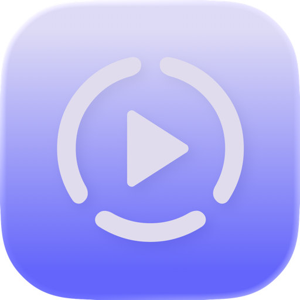
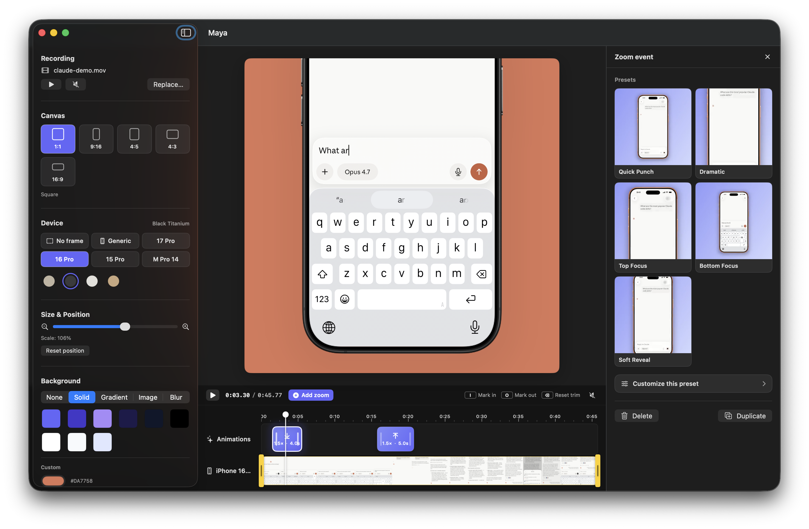

<div align="center">
  

  # Maya Studio

  **A fork of Maya tuned for polished product videos, richer device framing, timeline trimming, and faster App Store / social exports.**

  Native macOS editor for turning screen recordings into framed, animated marketing clips with zoom moments, trim controls, preset previews, and transparent or social-ready exports.

  
</div>

---

## What changed in this version

Maya Studio keeps the original Maya foundation, then adds a more opinionated editor workflow:

- Expanded canvas presets for square, vertical, portrait social, landscape, and widescreen exports.
- More flexible device catalog: physical iPhone Pro frames, MacBook Pro 14, generic phone, classic phone, Android-style phone, tablet, laptop, and no-frame modes.
- Generic/no-frame controls for corner radius, bezel width, bezel color, and shadows.
- Timeline-first editing with draggable zoom segments, edge resizing, playhead snapping, and inline editing.
- Video trim controls with independent clip timeline position, so trimming the source and moving the clip are separate actions.
- Animation preset previews bundled into the app.
- App Store and marketing-focused output polish, including transparent HEVC-with-alpha export.

This fork intentionally differs from the upstream app. The project folder and Xcode target still use the existing `Maya` source layout to avoid noisy churn, but the app product and user-facing name are **Maya Studio**.

## Features

### Device framing

- Drop in an iPhone, iPad, MacBook, Android, or app demo recording.
- Choose physical frames where available, or use configurable drawn frames for brand-agnostic mockups.
- Scale and reposition the device directly on the canvas.
- Add shadows, solid colors, gradients, image backgrounds, blurred-video backgrounds, or transparent backgrounds.

### Timeline and motion

- Trim the clip with draggable in/out handles.
- Move the clip along the timeline without changing the selected source range.
- Add zoom segments from the track or toolbar.
- Drag zoom blocks to move them and drag their edges to resize them.
- Snap animation timing to quarter-second marks and the playhead.
- Tune scale, focus, duration, easing, and zoom-in/out timing from the side editor.

### Export

- Export social-ready `.mp4` files using the selected canvas aspect.
- Export transparent `.mov` files with HEVC alpha when the background is set to none.
- Exported videos include device frame, background, shadows, trim, and zoom animation.

## Keyboard shortcuts

| Key | Action |
|---|---|
| <kbd>Space</kbd> | Play / pause |
| <kbd>M</kbd> | Mute / unmute |
| <kbd>I</kbd> | Mark trim in |
| <kbd>O</kbd> | Mark trim out |
| <kbd>Delete</kbd> | Delete selected zoom event |
| <kbd>Command</kbd> + <kbd>D</kbd> | Duplicate selected zoom event |
| <kbd>Left</kbd> / <kbd>Right</kbd> | Scrub 0.25 s |
| <kbd>Shift</kbd> + <kbd>Left</kbd> / <kbd>Right</kbd> | Scrub 1 s |

## Tech stack

- SwiftUI and AppKit
- AVFoundation custom video composition
- Core Image and Metal compositing
- HEVC-with-alpha export support
- Swift Observation and async/await
- Sandboxed local video adoption for reliable preview and export access

## Requirements

- macOS 26.3 or later
- Xcode 26.5 or later
- `.mp4` or `.mov` screen recording

## Build and run

```bash
git clone https://github.com/AyoParadis/Maya.git
cd Maya
open Maya.xcodeproj
```

Run the `Maya` target in Xcode. The built app is named **Maya Studio**.

## Code map

```text
Maya/
├── MayaApp.swift                 App entry
├── ContentView.swift             Root view
├── Models/                       Project state, device catalog, canvas sizes, animation specs
├── Services/                     Export, compositing, thumbnails, animation sampling
├── Views/                        Editor, canvas, sidebar, timeline, animation editor
├── Views/Timeline/               Ruler, clip trimming, thumbnails, zoom animation track
├── Resources/PresetPreviews/     Bundled preset preview videos
└── Assets.xcassets/              App icon and device frame assets
```

## Upstream

Maya Studio is derived from [ronaldo-avalos/Maya](https://github.com/ronaldo-avalos/Maya). Upstream remains the source for the original app direction; this fork carries additional editor, device, canvas, and export workflow changes.

## License

MIT. See [LICENSE](LICENSE).
