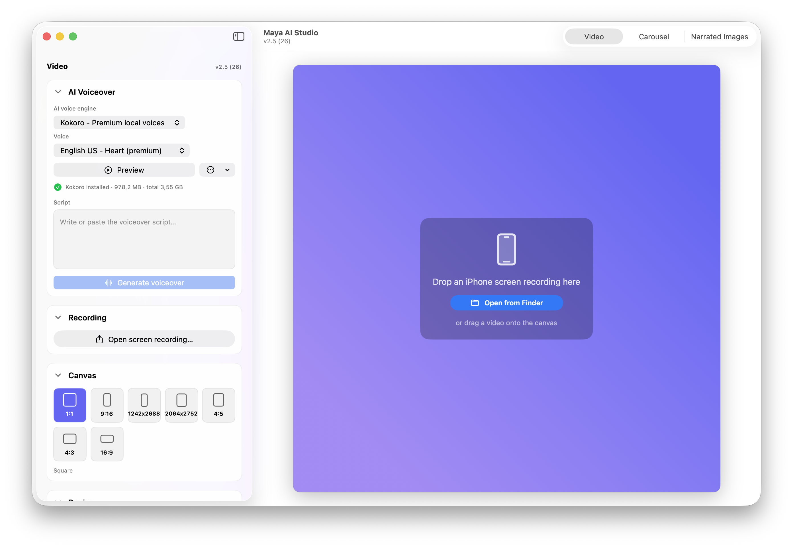
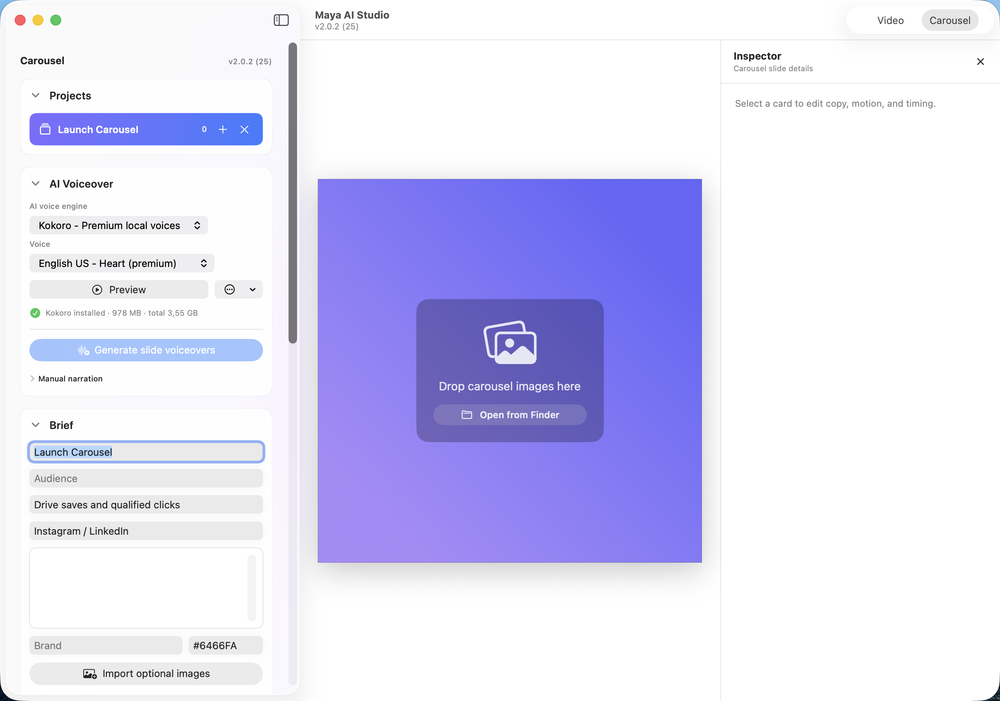
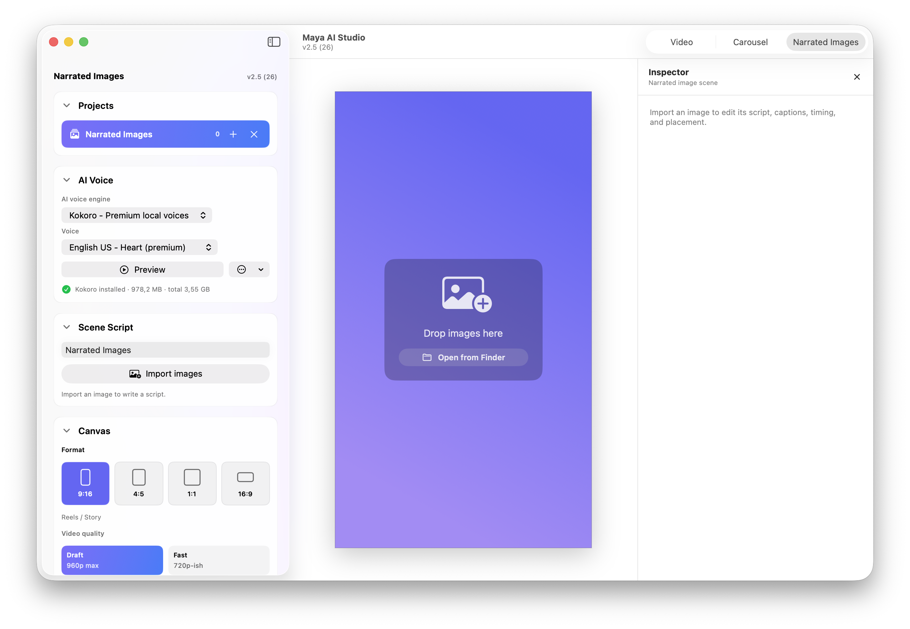

<div align="center">
  

  # Maya AI Studio

  **AI-assisted macOS editor for product demos, App Store previews, social videos, carousel creatives, and device mockup exports.**

  Maya turns screen recordings and product image sets into polished videos, transparent overlays, carousel assets, and launch-ready social clips.

  Current release: **Maya AI Studio 2.5.1**

</div>

---

## Overview

Maya AI Studio is a native macOS creative editor for makers, designers, and app teams. It helps turn raw app recordings, product screenshots, and launch assets into finished videos without using a heavyweight video editor.

The public app name is **Maya AI Studio** and the bundle identifier is `com.dlmapps.MayaAIStudio`. Some internal paths still use the original `Maya` name, including the source folder, Xcode project, and target.

## Three Creation Modes

Maya 2.5.1 is built around three distinct creation modes, each tuned for a different content workflow:

- **Video Mode** turns screen recordings into polished product demos, social videos, transparent overlays, and device mockup exports.
- **Carousel Mode** turns product images and screenshots into motion carousels, still image sets, narrated slide videos, and handoff bundles.
- **Narrated Images Mode** turns plain images into vertical narrated videos with per-image scripts, local AI voiceover, voice-aligned captions, draggable caption placement, and burned-in MP4 export.

## Screenshots

### Video Mode



### Carousel Mode



### Narrated Images Mode



## Modes

### Video Mode

Create polished product videos from `.mp4` and `.mov` recordings.

- Trim recordings with timeline controls.
- Place recordings inside iPhone, Android, tablet, laptop, MacBook, or no-frame mockups.
- Add background colors, gradients, image backgrounds, blurred-video backgrounds, shadows, and transparent backgrounds.
- Add zoom segments and subtle motion for product walkthroughs.
- Generate AI-assisted edit plans through the local Codex CLI.
- Export social-ready `.mp4` files or transparent HEVC-with-alpha `.mov` overlays.

### Carousel Mode

Create social carousel videos, still image sets, and handoff bundles from product images.

- Import app screens, launch graphics, screenshots, or ad images.
- Build projects for `9:16`, `4:5`, `1:1`, and `16:9` formats.
- Choose motion presets such as Still, Subtle Zoom, Punch Zoom, Pan, or Auto.
- Detect slide text locally with Apple Vision OCR.
- Generate per-slide narration and align voiceover timing to the carousel timeline.
- Export `.mp4` videos, `.png` still sets, or structured bundle folders.

### Narrated Images Mode

Create vertical narrated image videos from plain images.

- Import images with no text baked into them.
- Write a spoken script for each image scene.
- Generate local AI voiceover and editable burned-in caption beats from the script.
- Align caption timing to the generated voiceover with a local WhisperX-style forced alignment environment.
- Generate all scripted scenes as a queue so voice generation and caption alignment can stay warm across the project.
- Drag caption placement directly on the canvas per image.
- Export `.mp4` videos with image motion, voiceover, and captions.

## Local AI

Maya uses local-first AI workflows where possible.

- **AI Director** uses your installed `codex` command to suggest trim and zoom edits for product demos.
- **Carousel script cleanup** can use Codex to clean OCR-damaged text before narration.
- **Voiceover generation** runs through local voice engines installed into isolated Python environments in Application Support.
- **Narrated Images caption alignment** can run locally in its own isolated Python environment to match captions to generated voiceover timing.
- **Narrated Images content creation** keeps local Kokoro and caption-alignment workers warm when available, and reuses generated narration for matching engine, voice, and script inputs.
- Generated narration, previews, and downloaded voice assets stay on the Mac unless a user-controlled tool sends data elsewhere.

Install and sign in to Codex before using AI Director or script cleanup:

```bash
codex login
```

## Voiceover

Maya supports local narration in Video and Carousel modes.

- Kokoro is the default local AI voice engine.
- Piper remains available as a fast fallback.
- Voice engines are installed into separate local Python virtual environments.
- The voiceover panel shows engine status, preview controls, storage usage, repair actions, and asset cleanup.
- Carousel mode can generate one narration clip per slide from edited text, planned text, or detected OCR text.

## Export

Maya can export:

- H.264 `.mp4` videos for social platforms and product demos.
- Transparent HEVC-with-alpha `.mov` files when the canvas background is set to none.
- Carousel `.mp4` videos with project-level or per-slide narration.
- Carousel `.png` still image sets.
- Carousel handoff bundles with video, stills, JSON data, copy, and a handoff README.

## Keyboard Shortcuts

| Key | Action |
|---|---|
| <kbd>Space</kbd> | Play / pause |
| <kbd>M</kbd> | Mute / unmute source audio |
| <kbd>I</kbd> | Mark trim in |
| <kbd>O</kbd> | Mark trim out |
| <kbd>Delete</kbd> | Delete selected zoom event |
| <kbd>Command</kbd> + <kbd>D</kbd> | Duplicate selected zoom event |
| <kbd>Left</kbd> / <kbd>Right</kbd> | Scrub 0.25 s |
| <kbd>Shift</kbd> + <kbd>Left</kbd> / <kbd>Right</kbd> | Scrub 1 s |

## Tech Stack

- SwiftUI and AppKit
- AVFoundation and AVAssetWriter
- Core Image and Metal compositing
- HEVC-with-alpha export
- Swift Observation and async/await
- Apple Vision OCR
- Local Codex CLI workflows
- Local Piper and Kokoro TTS environments

## Requirements

- macOS 26.2 or later
- Xcode 26.5 or later for development
- `.mp4` or `.mov` recordings for Video mode
- Image assets for Carousel mode
- Codex CLI installed and signed in for AI Director and carousel text cleanup
- Optional local voice engine setup through Maya for narration generation

## Release

Latest release: **Maya AI Studio 2.5.1**

[Download Maya AI Studio 2.5.1](https://github.com/AyoParadis/Maya/releases/tag/v2.5.1)
